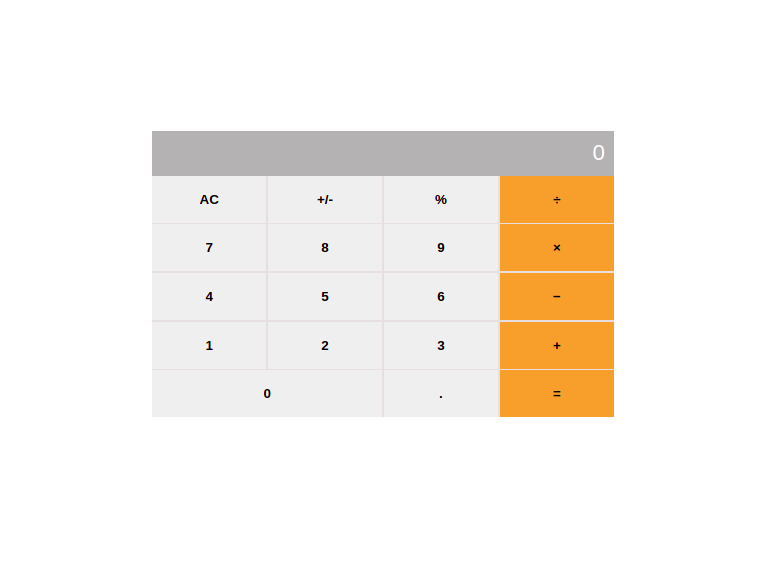

# Math-Magicians

"Math magicians" is a website for all fans of mathematics. It is a Single Page App (SPA) that allows users to:
- Make simple calculations.
- Read a random math-related quote.

## Built with

- HTML
- CSS
- JavaScript
- React Js
- Babel
- Webpack
- Visual Studio Code

## Screenshot

## Live Demo heroku

[Live Link](https://math-magicians-deployment.herokuapp.com/)
https://angry-golick-34dffb.netlify.app/

## Live Demo Netlify

[Live Link](https://angry-golick-34dffb.netlify.app/)

## Getting Started

To get a local copy up and running follow these simple example steps.

## Setup

- Clone this repository. 

## Run Tests

## Author:

 **Toluwase Ajise**

[<code></code>](https://github.com/whoistolu)
[<code></code>](https://twitter.com/Littletolu)
[<code></code>](https://www.linkedin.com/in/toluwase-ajise-9b40411b2/)

##  Contributing

Contributions, issues and feature requests are welcome!

Feel free to check the [issues page]().

## Show your support

Give a 👍 if you like this project!

## Acknowledgments

- Microverse

## 📝 License

This project is [MIT](./LICENSE.md) licensed.